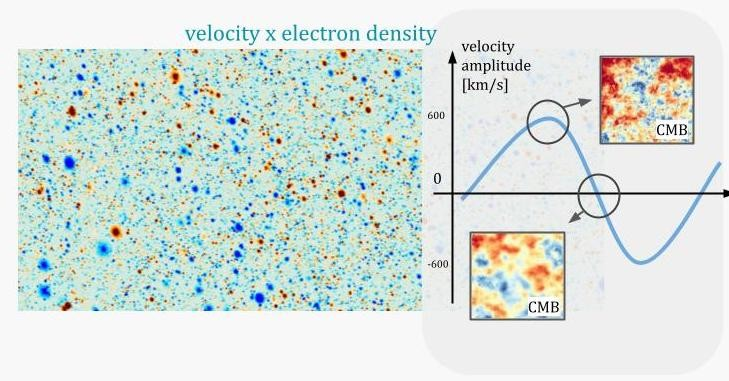



Scientific programs involving joint-analyses of different tracers of large-scale structure (LSS) and CMB are increasingly gaining attention as they often increase the prospects to detect and characterise new signals by reducing systematics, cancelling cosmic variance and breaking degeneracies. 
My research on these lines focuses in part on the reconstruction of large-scale cosmological fluctuations at different epochs of the Universe by using the CMB as a back-light; observing the scattering and gravitational lensing effects on the CMB by the intervening cosmological structure. My continuing work has demonstrated that this program will provide the most precise tests of fundamental physics and has the potential to open new and unique windows into unexplored epochs of structure formation, while not requiring new experiments other than those being built or proposed. 

I am interested in the following research questions: 
1. What were the dynamics and interactions in the early Universe? 
2. What is the nature of dark matter and dark energy? 
3. What are the fundamental principles that govern the major cosmological transitions in our Universe, such as hydrogen and helium reionization? 
4. How can we increase the prospects to learn fundamental physics and astrophysics from cosmological surveys? 

# Kinetic Sunyaev Zel'dovich tomography

In the recent years I have authored research papers which demonstrated that the kinetic Sunyaev Zel'dovich (kSZ) tomography (or radial-velocity reconstruction) (Cayuso et al 2020) will provide the most competitive constraints on primordial non-Gaussianity (Kumar et al 2022) and isocurvature (Hotinli et al 2019, Kumar et al 2022), smoking-gun signatures of inflationary scenarios or unknown components that may have been active during the early epoch of our Universe. In the former study, we have also demonstrated an opportunity to unambiguously probe unknown components in the early Universe by comparing different forms of higher-order statistics of the density fluctuations. These efforts are complementary to the core science goals of upcoming CMB experiments, such as measuring the effective number of relativistic species. My research has shown, for example, that the Figure of Merit (FoM) characterising the statistical information content of the joint analysis of large-scale galaxy clustering and velocity fields (latter reconstructed from measurements of the kSZ effect) with Simons Observatory and DESI data by 2026 can be greater by a factor of over an order-of-magnitude compared to considering DESI galaxy clustering in isolation. After the first year data release of LSST, this difference could reach over two orders of magnitude compared to considering LSST in isolation.

Kinetic Sunyaev Zel'dovich (kSZ) effect is a doppler effect due to CMB photons scattering off on energetic electrons in the large-scale structure that have some non-zero radial velocity. This effect is very significant and will dominate the small-scale observations of the black-body CMB in the upcoming decade. Below, you can see how this effects looks like from the websky simulation. It is   these small-scale distortions in the CMB intensity that we measure.

 

What is important about this effect is that it traces the bulk velocity fields of electrons — in that when electrons have larger radial velocity, the effect is more apparent, and when they have lower velocity effect is less apparent. As a result we can write estimators that capitalize on this statistical anisotropy to reconstruct the large scale velocity field — and the methods we have been developing are quite promising suggesting we will be able to recover information about the cosmological velocity field on large scales very efficiently this way (see e.g. Cayuso et al 2020). The tomographic reconstruction is demonstrated using a simation below for a narrow redshift bin near z=0.5 with noise and foreground specifications matching S3 survey specifications.
