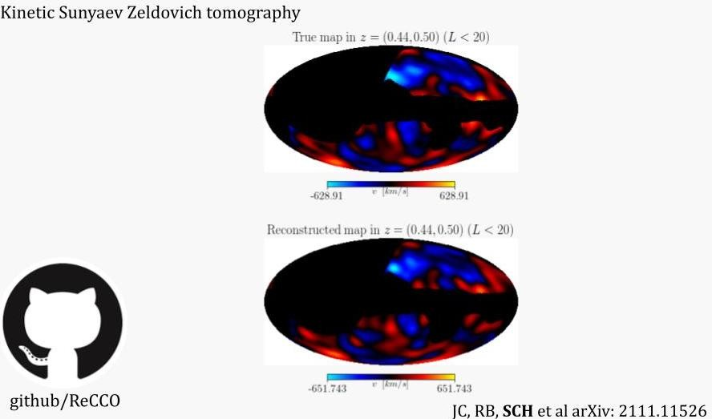
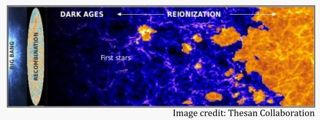
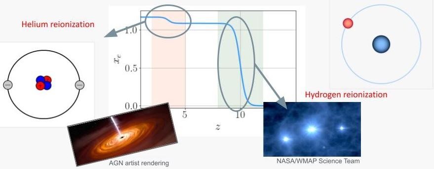



Scientific programs involving joint-analyses of different tracers of large-scale structure (LSS) and CMB are increasingly gaining attention as they often increase the prospects to detect and characterise new signals by reducing systematics, cancelling cosmic variance and breaking degeneracies. 
My research on these lines focuses in part on the reconstruction of large-scale cosmological fluctuations at different epochs of the Universe by using the CMB as a back-light; observing the scattering and gravitational lensing effects on the CMB by the intervening cosmological structure. My continuing work has demonstrated that this program will provide the most precise tests of fundamental physics and has the potential to open new and unique windows into unexplored epochs of structure formation, while not requiring new experiments other than those being built or proposed. 

I am interested in the following research questions: 
1. What were the dynamics and interactions in the early Universe? 
2. What is the nature of dark matter and dark energy? 
3. What are the fundamental principles that govern the major cosmological transitions in our Universe, such as hydrogen and helium reionization? 
4. How can we increase the prospects to learn fundamental physics and astrophysics from cosmological surveys? 

# Kinetic Sunyaev Zel'dovich tomography

In the recent years I have authored research papers which demonstrated that the kinetic Sunyaev Zel'dovich (kSZ) tomography (or radial-velocity reconstruction) (Cayuso et al 2020) will provide the most competitive constraints on primordial non-Gaussianity (Kumar et al 2022) and isocurvature (Hotinli et al 2019, Kumar et al 2022), smoking-gun signatures of inflationary scenarios or unknown components that may have been active during the early epoch of our Universe. In the former study, we have also demonstrated an opportunity to unambiguously probe unknown components in the early Universe by comparing different forms of higher-order statistics of the density fluctuations. These efforts are complementary to the core science goals of upcoming CMB experiments, such as measuring the effective number of relativistic species. My research has shown, for example, that the Figure of Merit (FoM) characterising the statistical information content of the joint analysis of large-scale galaxy clustering and velocity fields (latter reconstructed from measurements of the kSZ effect) with Simons Observatory and DESI data by 2026 can be greater by a factor of over an order-of-magnitude compared to considering DESI galaxy clustering in isolation. After the first year data release of LSST, this difference could reach over two orders of magnitude compared to considering LSST in isolation.

Kinetic Sunyaev Zel'dovich (kSZ) effect is a doppler effect due to CMB photons scattering off on energetic electrons in the large-scale structure that have some non-zero radial velocity. This effect is very significant and will dominate the small-scale observations of the black-body CMB in the upcoming decade. Below, you can see how this effects looks like from the websky simulation. It is   these small-scale distortions in the CMB intensity that we measure.

 

What is important about this effect is that it traces the bulk velocity fields of electrons — in that when electrons have larger radial velocity, the effect is more apparent, and when they have lower velocity effect is less apparent. As a result we can write estimators that capitalize on this statistical anisotropy to reconstruct the large scale velocity field — and the methods we have been developing are quite promising suggesting we will be able to recover information about the cosmological velocity field on large scales very efficiently this way (see e.g. Cayuso et al 2020). The tomographic reconstruction is demonstrated using a simation below for a narrow redshift bin near z=0.5 with noise and foreground specifications matching S3 survey specifications.

 

In addition to probing large-scale deviations from LCDM, the reconstruction program can contribute significantly to the characterisation of both hydrogen (Hotinli and Johnson 2020) and helium (Hotinli et al 2022) reionization (image below).

 

Characterising helium reionization has great significance for understanding galaxy formation, quasar activity and cosmology, and may open a new window on big bang nucleosynthesis.  Since photons emitted by the first stars (sourcing the reionization of hydrogen) are not energetic enough to fully ionize helium, helium reionization occurs only after the emergence of a substantial number of quasars. As a result, the history of helium reionization strongly depends on the properties of quasars, such as their luminosity function, accretion mechanisms and other astrophysics, clustering, variability, lifetimes, as well as the general growth and evolution of super-massive black holes. Since essentially all of the helium in the Universe is ultimately doubly ionized, the total change in the ionization fraction is also a measure of the primordial helium abundance—a sensitive probe of big bang nucleosynthesis. Furthermore, probing helium reionization can also improve our understanding of relativistic species through improving the primordial helium fraction measurement and breaking the degeneracy between the number of relativistic species and primordial helium fraction. As the primordial helium abundance depends on the weak interaction rates as well as the neutron lifetime, improving its measurement can also allow further valuable insights into our cosmological history. Observational challenges posed by helium emission line measurements make additional probes extremely valuable.

One of the main research programs I lead focuses on characterisation of both hydrogen (Hotinli and Johnson 2020) and helium reionization (Hotinli et al 2022)  from joint analyses of LSS and CMB data. In particular, characterising helium reionization has great significance for understanding galaxy formation, quasar activity and cosmology.  Since photons emitted by the first stars (sourcing the reionization of hydrogen) are not energetic enough to fully ionize helium, helium reionization occurs only after the emergence of a substantial number of quasars.

As a result, the history of helium reionization strongly depends on the properties of quasars, such as their luminosity function, accretion mechanisms and other astrophysics, clustering, variability, lifetimes, as well as the general growth and evolution of super-massive black holes. Observational challenges posed by helium emission line measurements make additional probes extremely valuable. I anticipate a multitude of studies will follow my work, capitalising on the statistical power of cross-correlations between CMB and different high-redshift LSS probes. These results are extremely promising and will likely re-ignite the interest from the community for helium reionization. My efforts currently focus on advancing scientific programs involving characterisation of helium reionization with joint analyses of CMB and LSS including contributing to building up the science cases of the line-intensity signals, which will be a promising direction within this program, and transform this area into an active, evolving field of research. 

 

On this image: We now know that the hydrogen and helium fully ionizes in the Universe after the formation of first luminous objects. During this process, the ionization fraction (the fraction of free electrons) goes from zero to, say 1, for all the electrons in the hydrogen atom being ionized (kicked away of their proton). This happens soon after the first stars form. You may notice that this line does not end at one, however, which is because helium also ionizes, loosing its first electron around the same time as hydrogen. However the second electron in helium requires much more energy to ionize which only happens after sufficient numbers of much more luminous objects such as quasars, due to active galactic nuclei form… As a result, the history of helium reionization strongly depends on the properties of quasars, such as their luminosity, accretion mechanisms and other very much unknown astrophysics, clustering, variability, lifetimes, as well as the general growth and evolution of super-massive black holes. In a recent work, I have shown for the first time that the joint analysis of the CMB and upcoming high-redshift galaxy surveys can indeed probe this epoch. (See arXiv:2207.07660)
